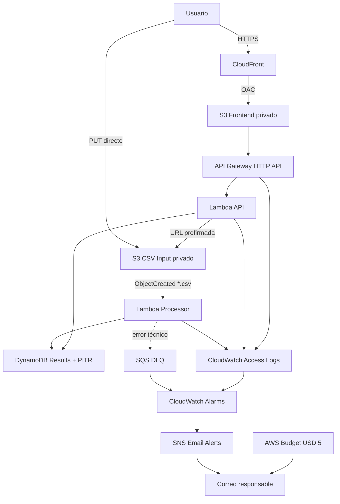

# DatosSur — Inteligencia comercial serverless para ventas

DatosSur es una plataforma web serverless desplegada en AWS que transforma archivos CSV de ventas en métricas, visualizaciones, indicadores de calidad, insights y recomendaciones comerciales.

El proyecto está orientado a pequeños emprendimientos o comercios que registran sus ventas en planillas y necesitan interpretar sus datos sin construir fórmulas, gráficos o procesos manuales en cada archivo.

## 1. Propuesta de valor

DatosSur no se limita a mostrar el contenido de un CSV. El sistema:

- valida la estructura y calidad de los datos;
- calcula ventas, unidades, transacciones y ticket promedio;
- identifica productos y categorías líderes;
- mide concentración y calidad del dataset;
- genera un indicador comercial orientativo;
- entrega insights y recomendaciones basadas en reglas;
- conserva trazabilidad de archivos válidos y rechazados;
- publica los resultados en un dashboard accesible desde el navegador.

El indicador comercial es una ayuda descriptiva basada en calidad y concentración de las ventas. No representa rentabilidad, utilidad ni asesoría financiera.

## 2. Estado actual

El flujo principal se encuentra desplegado y validado de extremo a extremo:

1. El usuario abre el frontend publicado con CloudFront.
2. Selecciona un archivo CSV.
3. El frontend solicita una URL prefirmada mediante `POST /upload-url`.
4. El archivo se carga directamente al bucket privado de entrada.
5. S3 invoca automáticamente la Lambda procesadora.
6. La Lambda valida el CSV, calcula métricas e insights y guarda el resultado en DynamoDB.
7. El frontend consulta la API y muestra el análisis en el dashboard.

### Despliegue vigente

| Recurso | Valor |
|---|---|
| Frontend | `https://dziky8atb7317.cloudfront.net` |
| API Gateway | `https://6zv537rbm5.execute-api.us-east-1.amazonaws.com` |
| Región | `us-east-1` |
| Tabla DynamoDB | `datossur-dev-results` |
| Lambda API | `datossur-dev-api` |
| Lambda Processor | `datossur-dev-processor` |

> Las URL de CloudFront y API Gateway pueden cambiar después de ejecutar `terraform destroy` y desplegar nuevamente. La fuente definitiva es `terraform output`.

## 3. Arquitectura



La descripción detallada está en [`docs/arquitectura.md`](docs/arquitectura.md).

## 4. Servicios AWS

- Amazon S3
- Amazon CloudFront
- Amazon API Gateway HTTP API
- AWS Lambda
- Amazon DynamoDB
- Amazon SQS
- Amazon SNS
- Amazon CloudWatch
- AWS Budgets
- AWS IAM
- Terraform con backend remoto S3 y bloqueo DynamoDB

## 5. Funcionalidades principales

### Carga y validación

- Selección de archivos `.csv` desde el navegador.
- Límite máximo configurable, actualmente 5 MB.
- URL prefirmada con expiración de 900 segundos.
- Validación local y en backend.
- Soporte para campos entre comillas y comas dentro de valores.
- Manejo de BOM, columnas obligatorias, fechas, cantidades y precios.
- Errores de validación controlados sin activar reintentos técnicos ni la DLQ.

### Métricas e inteligencia comercial

- Total vendido.
- Total de unidades.
- Número de transacciones.
- Ticket promedio.
- Valor promedio por unidad.
- Calidad del dataset.
- Productos líderes por unidades e ingresos.
- Ventas y concentración por categoría.
- Indicador comercial orientativo.
- Insights y recomendaciones con evidencia y prioridad.
- Muestras de filas inválidas.

### Dashboard

- Selección de datasets.
- Tarjetas ejecutivas.
- Gráficos de productos y categorías.
- Panel de insights.
- Panel de recomendaciones.
- Visualización diferenciada de archivos `COMPLETADO` y `ERROR`.
- Espera del archivo recién cargado mediante su clave exacta.

## 6. Rutas de la API

| Método | Ruta | Descripción |
|---|---|---|
| `GET` | `/health` | Estado y límites principales de la API |
| `GET` | `/datasets` | Lista los últimos datasets |
| `GET` | `/datasets/{dataset_id}` | Obtiene un dataset individual |
| `POST` | `/upload-url` | Genera una URL prefirmada para cargar un CSV |

Ejemplo:

```powershell
$Api = "https://6zv537rbm5.execute-api.us-east-1.amazonaws.com"

Invoke-RestMethod "$Api/health"
Invoke-RestMethod "$Api/datasets" | ConvertTo-Json -Depth 20
```

## 7. Formato CSV

Encabezado obligatorio:

```csv
fecha,producto,categoria,cantidad,precio_unitario
```

Ejemplo:

```csv
fecha,producto,categoria,cantidad,precio_unitario
2026-06-01,Miel Nativa,Alimentos,2,4500
2026-06-01,Lana Artesanal,Textil,1,12000
2026-06-02,"Mermelada, frutilla",Alimentos,3,3500
```

Reglas principales:

- `fecha`: fecha válida en formato `AAAA-MM-DD`;
- `producto`: texto no vacío;
- `categoria`: texto no vacío;
- `cantidad`: número mayor que cero;
- `precio_unitario`: número mayor o igual que cero.

Las filas incorrectas se contabilizan. Un archivo sin ninguna fila válida queda registrado con estado `ERROR`.

## 8. Estructura del repositorio

```text
datossur/
├── README.md
├── .gitignore
├── docs/
│   ├── arquitectura.md
│   ├── costos.md
│   ├── evidencias.md
│   └── diagramas/
│       └── arquitectura.mmd
├── frontend/
│   ├── index.html
│   ├── app.js
│   └── styles.css
├── samples/
│   ├── ventas_validas.csv
│   └── ventas_invalidas.csv
├── src/
│   └── lambdas/
│       ├── api/
│       │   └── index.mjs
│       └── processor/
│           └── index.mjs
└── infra/
    ├── bootstrap/
    ├── modules/
    │   ├── api/
    │   ├── budget/
    │   ├── frontend/
    │   ├── monitoring/
    │   ├── processing/
    │   └── storage/
    ├── backend.tf
    ├── backend.hcl.example
    ├── locals.tf
    ├── main.tf
    ├── outputs.tf
    ├── providers.tf
    ├── terraform.tfvars.example
    ├── variables.tf
    └── versions.tf
```

## 9. Prerrequisitos

- Cuenta AWS con permisos suficientes.
- AWS CLI configurado.
- Terraform.
- Git.
- PowerShell.
- Node.js para validar sintaxis de las Lambdas y el frontend.

Comprobación:

```powershell
aws sts get-caller-identity
terraform version
node --version
git --version
```

## 10. Configuración local

Crear:

```text
infra/terraform.tfvars
```

a partir de:

```text
infra/terraform.tfvars.example
```

Ejemplo:

```hcl
project_name       = "datossur"
environment        = "dev"
aws_region         = "us-east-1"
owner_email        = "correo-del-responsable@example.com"
budget_limit_usd   = 5
lambda_runtime     = "nodejs20.x"
log_retention_days = 14

upload_cors_allowed_origins = [
  "https://DOMINIO_CLOUDFRONT"
]

max_upload_size_bytes         = 5242880
upload_url_expiration_seconds = 900
dataset_limit                 = 25

api_throttling_rate_limit  = 10
api_throttling_burst_limit = 20

input_object_expiration_days                = 30
input_noncurrent_version_expiration_days    = 7
frontend_noncurrent_version_expiration_days = 30

enable_dynamodb_pitr = true
```

`terraform.tfvars` y `backend.hcl` son archivos locales y no deben versionarse.

## 11. Crear el backend remoto

Si el backend no existe:

```powershell
cd infra\bootstrap

terraform init
terraform fmt
terraform validate
terraform plan
terraform apply
terraform output
```

Crear `infra/backend.hcl` usando los outputs del bootstrap:

```hcl
bucket         = "NOMBRE_BUCKET_TFSTATE"
key            = "datossur/dev/terraform.tfstate"
region         = "us-east-1"
dynamodb_table = "NOMBRE_TABLA_LOCK"
encrypt        = true
```

## 12. Desplegar la infraestructura principal

```powershell
cd infra

terraform init "-backend-config=backend.hcl"
terraform fmt -recursive
terraform validate
terraform plan
terraform apply
terraform output
```

Los módulos desplegados son:

- `storage`
- `processing`
- `api`
- `frontend`
- `monitoring`
- `budget`

## 13. Validación funcional

### Desde el navegador

1. Abrir la URL de CloudFront.
2. Seleccionar `samples/ventas_validas.csv`.
3. Presionar **Analizar CSV**.
4. Esperar el estado `COMPLETADO`.
5. Revisar métricas, insights, recomendaciones y gráficos.
6. Repetir con un archivo parcialmente inválido.
7. Seleccionar un dataset `ERROR` y revisar el mensaje controlado.

### Desde PowerShell

```powershell
cd infra

$Api = terraform output -raw api_endpoint
$Csv = Get-Item "..\samples\ventas_validas.csv"

$Body = @{
    filename  = $Csv.Name
    file_size = $Csv.Length
} | ConvertTo-Json -Compress

$Upload = Invoke-RestMethod `
    -Method Post `
    -Uri "$Api/upload-url" `
    -ContentType "application/json; charset=utf-8" `
    -Body $Body

Invoke-WebRequest `
    -Method Put `
    -Uri $Upload.upload_url `
    -InFile $Csv.FullName `
    -ContentType "text/csv"

Start-Sleep -Seconds 10
Invoke-RestMethod "$Api/datasets" | ConvertTo-Json -Depth 20
```

## 14. Seguridad y resiliencia

- Buckets S3 privados y cifrados.
- CloudFront con Origin Access Control.
- CORS restringido al dominio vigente de CloudFront.
- HTTPS y cabeceras HSTS, CSP, `X-Frame-Options`, `X-Content-Type-Options` y `Referrer-Policy`.
- Roles IAM separados y de mínimo privilegio.
- Sin credenciales embebidas.
- URL prefirmada de corta duración.
- Límite de archivo de 5 MB.
- Throttling de API Gateway: 10 solicitudes por segundo y burst de 20.
- Access logs estructurados de API Gateway.
- SQS DLQ para fallos técnicos.
- Errores de negocio tratados sin reintentos.
- Point-in-Time Recovery de DynamoDB.
- Lifecycle de S3 para controlar acumulación de archivos y versiones.
- Retención de CloudWatch Logs de 14 días.

## 15. Observabilidad

Logs:

```powershell
aws logs tail /aws/lambda/datossur-dev-api `
  --region us-east-1 `
  --since 15m

aws logs tail /aws/lambda/datossur-dev-processor `
  --region us-east-1 `
  --since 15m
```

Access logs de API Gateway:

```text
/aws/apigateway/datossur-dev-http-api/access
```

Alarmas:

- errores de Lambda API;
- errores de Lambda Processor;
- respuestas 5XX de API Gateway;
- mensajes visibles en la DLQ.

## 16. Costos

El análisis completo se encuentra en [`docs/costos.md`](docs/costos.md).

Resumen:

| Escenario | Estimación |
|---|---:|
| MVP académico conservador | USD 0,71/mes |
| Crecimiento: 10.000 CSV/mes | USD 4,33/mes |
| Costo real observado durante pruebas | USD 0,00 |
| Alternativa EC2 mínima | USD 11,88/mes |

El proyecto mantiene un Budget mensual de USD 5.

## 17. Idempotencia

Después del despliegue:

```powershell
terraform plan
```

Resultado esperado:

```text
No changes. Your infrastructure matches the configuration.
```

Esto demuestra que Terraform no intenta duplicar ni modificar recursos cuando la configuración y el estado coinciden.

## 18. Limpieza

Primero destruir la infraestructura principal:

```powershell
cd infra
terraform destroy
```

Después, únicamente si se desea eliminar también el estado remoto:

```powershell
cd bootstrap
terraform destroy
```

El backend no debe destruirse antes de la infraestructura principal.

## 19. Limitaciones conocidas

- No existe autenticación de usuarios.
- El endpoint público utiliza throttling, pero no cuotas por usuario.
- `/datasets` usa un listado limitado y no paginación completa.
- Las recomendaciones se basan en reglas descriptivas; no son un modelo predictivo.
- El indicador comercial no mide utilidad, margen ni rentabilidad.
- La aplicación procesa archivos pequeños y no está diseñada para analítica masiva.

## 20. Documentación

- [`docs/arquitectura.md`](docs/arquitectura.md)
- [`docs/costos.md`](docs/costos.md)
- [`docs/evidencias.md`](docs/evidencias.md)
- [`docs/diagramas/arquitectura.mmd`](docs/diagramas/arquitectura.mmd)

## 21. Conclusión

DatosSur presenta una solución cloud funcional, reproducible y de bajo costo. La combinación de S3, Lambda, DynamoDB, API Gateway y CloudFront permite procesar ventas bajo demanda sin mantener servidores encendidos.

El producto agrega valor frente a una revisión manual de planillas porque valida la información, resume el comportamiento de ventas y entrega insights y recomendaciones interpretables desde un dashboard.
