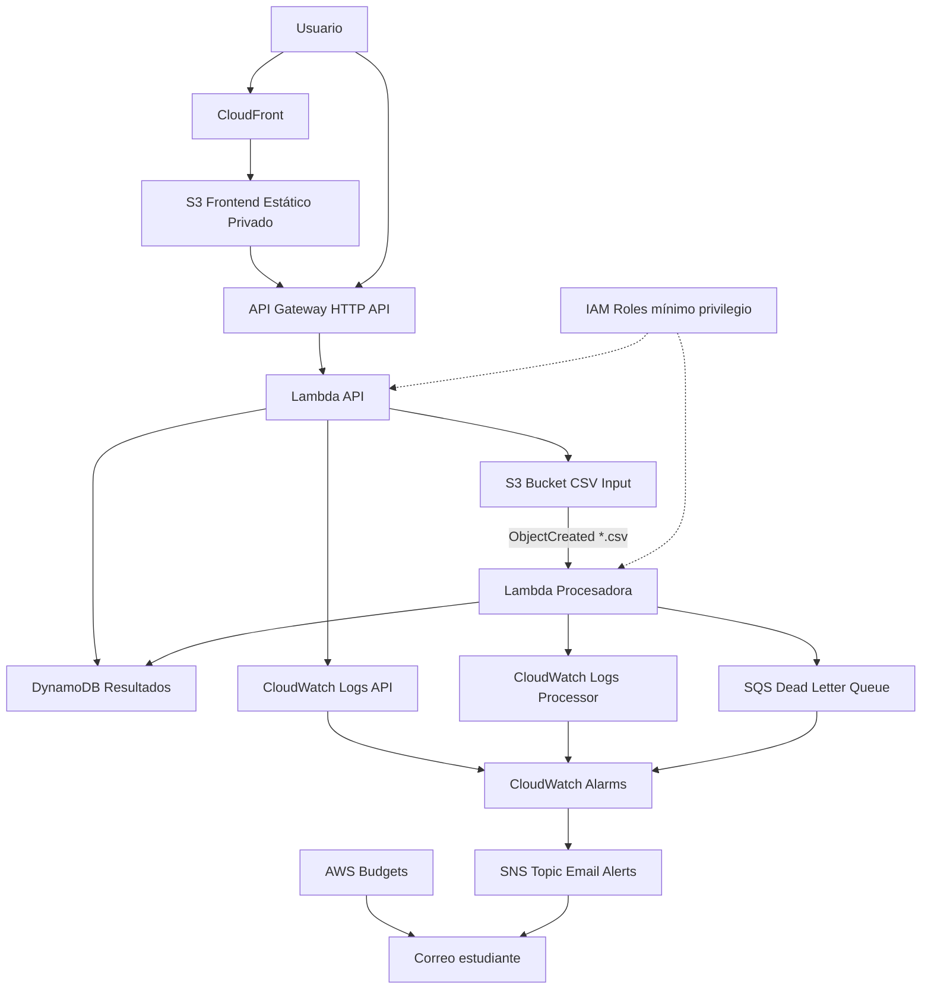

# DatosSur — Infraestructura como Código

DatosSur es una plataforma serverless en AWS para procesar archivos CSV de ventas de pequeños emprendimientos del sur de Chile. El sistema permite cargar archivos CSV, procesarlos automáticamente con AWS Lambda, guardar resultados en DynamoDB y consultarlos desde una API y un frontend web.

Este repositorio corresponde al Hito 2 del proyecto final de la asignatura Taller de Ingeniería Informática. La infraestructura fue definida con Terraform, usando módulos propios, backend remoto, seguridad IAM, monitoreo con CloudWatch y control de costos con AWS Budgets.

## 1. Objetivo del proyecto

El objetivo de DatosSur es construir una arquitectura cloud reproducible para una solución de analítica simple de ventas.

El sistema permite:

* Cargar archivos CSV de ventas.
* Procesar automáticamente los datos.
* Calcular estadísticas básicas.
* Guardar resultados en DynamoDB.
* Consultar resultados mediante API Gateway.
* Visualizar resultados desde un frontend publicado con CloudFront.
* Observar logs y errores con CloudWatch.
* Recibir alertas por correo con SNS.
* Controlar costos con AWS Budgets.

## 2. Arquitectura general

DatosSur usa una arquitectura serverless y event-driven. El procesamiento comienza cuando se sube un archivo CSV al bucket de entrada en S3. Ese evento invoca una función Lambda procesadora, que lee el archivo, calcula estadísticas y guarda los resultados en DynamoDB.

El frontend se publica mediante CloudFront y consulta una API HTTP creada con API Gateway y Lambda.



El diagrama también se encuentra en:

```text
docs/diagramas/arquitectura.mmd
```

## 3. Servicios AWS utilizados

La solución utiliza los siguientes servicios:

* Amazon S3
* Amazon CloudFront
* AWS Lambda
* Amazon API Gateway HTTP API
* Amazon DynamoDB
* Amazon SQS
* Amazon SNS
* Amazon CloudWatch
* AWS Budgets
* AWS IAM
* Terraform con backend remoto S3 y bloqueo DynamoDB

## 4. URLs del despliegue

Frontend:

```text
https://dziky8atb7317.cloudfront.net
```

API Gateway:

```text
https://6zv537rbm5.execute-api.us-east-1.amazonaws.com
```

Rutas disponibles:

```text
GET  /health
GET  /datasets
GET  /datasets/{dataset_id}
POST /upload-url
```

## 5. Estructura del repositorio

```text
datossur/
├── README.md
├── .gitignore
├── docs/
│   ├── arquitectura.md
│   ├── evidencias.md
│   └── diagramas/
│       └── arquitectura.mmd
├── frontend/
│   ├── index.html
│   ├── styles.css
│   ├── app.js
├── samples/
│   ├── ventas_validas.csv
│   └── ventas_invalidas.csv
├── src/
│   └── lambdas/
│       ├── api/
│       │   └── index.mjs
│       └── processor/
│           └── index.mjs
└── infra/
    ├── bootstrap/
    ├── modules/
    │   ├── api/
    │   ├── budget/
    │   ├── frontend/
    │   ├── monitoring/
    │   ├── processing/
    │   └── storage/
    ├── backend.tf
    ├── backend.hcl.example
    ├── locals.tf
    ├── main.tf
    ├── outputs.tf
    ├── providers.tf
    ├── terraform.tfvars.example
    ├── variables.tf
    └── versions.tf
```

## 6. Prerrequisitos

Para ejecutar el proyecto se necesita:

* Cuenta AWS con permisos para crear recursos.
* AWS CLI configurado.
* Terraform instalado.
* PowerShell.
* Git.

Verificar credenciales AWS:

```powershell
aws sts get-caller-identity
```

Verificar Terraform:

```powershell
terraform version
```

## 7. Configuración de variables

Crear el archivo local:

```text
infra/terraform.tfvars
```

A partir del ejemplo:

```text
infra/terraform.tfvars.example
```

Contenido utilizado en este despliegue:

```hcl
project_name        = "datossur"
environment         = "dev"
aws_region          = "us-east-1"
owner_email         = "angelomarcelo.reyes@alumnos.ulagos.cl"
budget_limit_usd    = 5
lambda_runtime      = "nodejs20.x"
log_retention_days  = 14
```

El archivo `terraform.tfvars` no debe subirse a GitHub.

## 8. Backend remoto de Terraform

El proyecto usa backend remoto para guardar el estado de Terraform.

Recursos creados en `infra/bootstrap`:

* Bucket S3 para `tfstate`.
* Tabla DynamoDB para bloqueo del estado.
* Cifrado del bucket.
* Versionamiento del bucket.
* Bloqueo de acceso público.

Comandos para crear el backend:

```powershell
cd infra\bootstrap
terraform init
terraform fmt
terraform validate
terraform plan
terraform apply
```

Outputs obtenidos:

```text
tfstate_bucket_name = datossur-dev-tfstate-251335054638-f9e9bea5
tf_lock_table_name  = datossur-dev-tf-lock
```

Luego se configura el archivo local:

```text
infra/backend.hcl
```

Contenido usado:

```hcl
bucket         = "datossur-dev-tfstate-251335054638-f9e9bea5"
key            = "datossur/dev/terraform.tfstate"
region         = "us-east-1"
dynamodb_table = "datossur-dev-tf-lock"
encrypt        = true
```

Inicializar la infraestructura principal con backend remoto:

```powershell
cd ..
terraform init "-backend-config=backend.hcl"
```

## 9. Despliegue de infraestructura principal

Desde la carpeta `infra`:

```powershell
terraform init
terraform fmt -recursive
terraform validate
terraform plan
terraform apply
```

Confirmar con:

```text
yes
```

El despliegue crea los módulos:

* `storage`
* `processing`
* `api`
* `frontend`
* `monitoring`
* `budget`

## 10. Outputs principales

Para revisar los outputs:

```powershell
terraform output
```

Outputs relevantes del despliegue:

```text
frontend_url          = https://d3197zbvtz2fyf.cloudfront.net
api_endpoint          = https://6f87p2cazd.execute-api.us-east-1.amazonaws.com
input_bucket_name     = datossur-dev-csv-input-251335054638
results_table_name    = datossur-dev-results
processor_lambda_name = datossur-dev-processor
api_lambda_name       = datossur-dev-api
budget_name           = datossur-dev-monthly-budget
```

## 11. Pruebas funcionales

### Probar frontend público

Abrir en el navegador:

```text
https://dziky8atb7317.cloudfront.net

### Probar API

Desde PowerShell:

```powershell
$API_ENDPOINT = "https://6zv537rbm5.execute-api.us-east-1.amazonaws.com"

Invoke-RestMethod "$API_ENDPOINT/health"
Invoke-RestMethod "$API_ENDPOINT/datasets"
```

Resultado esperado de `/health`:

```text
status  : ok
project : DatosSur
service : api
```

### Subir CSV de prueba

Desde la raíz del proyecto:

```powershell
$INPUT_BUCKET = "datossur-dev-csv-input-251335054638"

aws s3 cp samples\ventas_validas.csv s3://$INPUT_BUCKET/uploads/ventas_validas.csv
aws s3 cp samples\ventas_invalidas.csv s3://$INPUT_BUCKET/uploads/ventas_invalidas.csv
```

Luego consultar:

```powershell
Invoke-RestMethod "$API_ENDPOINT/datasets"
```

El resultado debe mostrar datasets procesados con estado `COMPLETADO`.

## 12. Formato CSV esperado

El archivo CSV debe tener estas columnas:

```csv
fecha,producto,categoria,cantidad,precio_unitario
2026-06-01,Miel Nativa,Alimentos,2,4500
2026-06-01,Lana Artesanal,Textil,1,12000
2026-06-02,Mermelada Casera,Alimentos,3,3500
```

Columnas obligatorias:

* `fecha`
* `producto`
* `categoria`
* `cantidad`
* `precio_unitario`

Validaciones aplicadas:

* El archivo debe tener encabezado.
* `cantidad` debe ser número mayor que cero.
* `precio_unitario` debe ser número mayor o igual a cero.
* Las filas inválidas se contabilizan y se reportan en el resultado.

## 13. Observabilidad

Ver logs de Lambda API:

```powershell
aws logs tail /aws/lambda/datossur-dev-api --region us-east-1 --since 15m
```

Ver logs de Lambda procesadora:

```powershell
aws logs tail /aws/lambda/datossur-dev-processor --region us-east-1 --since 15m
```

Listar alarmas de CloudWatch:

```powershell
aws cloudwatch describe-alarms `
  --alarm-name-prefix datossur-dev `
  --region us-east-1 `
  --query "MetricAlarms[].{Name:AlarmName,State:StateValue,Metric:MetricName}" `
  --output table
```

Alarmas creadas:

* Errores de Lambda API.
* Errores de Lambda procesadora.
* Errores 5XX de API Gateway.
* Mensajes visibles en SQS DLQ.

## 14. Control de costos

Se creó un AWS Budget mensual:

```text
datossur-dev-monthly-budget
```

Límite:

```text
USD 5
```

Consultar budget:

```powershell
aws budgets describe-budget `
  --account-id 251335054638 `
  --budget-name datossur-dev-monthly-budget
```

## 15. Seguridad aplicada

Medidas implementadas:

* No hay credenciales embebidas en el código.
* Los buckets S3 bloquean acceso público.
* El frontend se expone mediante CloudFront con Origin Access Control.
* Las funciones Lambda usan roles IAM separados.
* Las políticas IAM aplican mínimo privilegio.
* Los logs tienen retención definida.
* Los recursos usan tags comunes.
* `.gitignore` evita subir `.tfstate`, `.terraform`, `.tfvars`, `.env` y archivos `.zip`.

Roles principales:

* `datossur-dev-api-role`
* `datossur-dev-processor-role`

## 16. Idempotencia

Para validar que Terraform no duplica recursos:

```powershell
terraform fmt -recursive
terraform validate
terraform plan
terraform apply
```

Resultado esperado del segundo `plan/apply`:

```text
No changes. Your infrastructure matches the configuration.

Apply complete! Resources: 0 added, 0 changed, 0 destroyed.
```

Esta prueba demuestra que la infraestructura es reproducible e idempotente.

## 17. Limpieza de recursos

La limpieza debe ejecutarse solo después de obtener todas las evidencias.

Primero destruir la infraestructura principal:

```powershell
cd infra
terraform destroy
```

Confirmar con:

```text
yes
```

Luego destruir el backend remoto:

```powershell
cd bootstrap
terraform destroy
```

Confirmar con:

```text
yes
```

El orden es importante. Primero se destruye la infraestructura principal y después el backend remoto, porque el estado remoto se necesita para eliminar correctamente los recursos.

## 18. Estado del Hito 1

El Hito 1 quedó implementado con:

* Arquitectura serverless funcional.
* Infraestructura modular con Terraform.
* Backend remoto S3 + DynamoDB Lock.
* API Gateway funcional.
* Lambda API funcional.
* Lambda procesadora funcional.
* Procesamiento real de CSV.
* Frontend funcional en CloudFront.
* DynamoDB para resultados.
* SQS DLQ.
* CloudWatch Logs.
* CloudWatch Alarms.
* SNS con suscripción por correo confirmada.
* AWS Budget mensual.
* IAM con mínimo privilegio.
* Tags comunes.
* Documentación y evidencias.

## 19. Documentación adicional

Documentos complementarios:

* `docs/arquitectura.md`
* `docs/evidencias.md`
* `docs/diagramas/arquitectura.mmd`

## 20. Conclusión

DatosSur cumple con los objetivos del Hito 1 al presentar una arquitectura cloud serverless, funcional, segura, monitoreada, documentada y reproducible mediante Terraform.

La solución queda preparada para un Hito 2 donde se podría mejorar la interfaz, agregar autenticación, incorporar gráficos y permitir cargas de archivos directamente desde el navegador.
