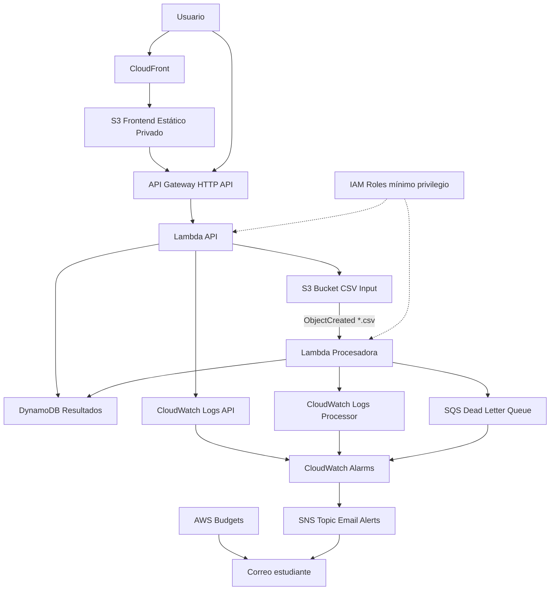

# Arquitectura del Proyecto DatosSur

## 1. Descripción general

DatosSur es una plataforma serverless desplegada en AWS para procesar archivos CSV de ventas. Está pensada para pequeños emprendimientos o comercios del sur de Chile que registran sus ventas en planillas y necesitan obtener indicadores simples sin realizar cálculos manuales.

El sistema permite cargar archivos CSV, procesarlos automáticamente, almacenar resultados y consultarlos desde una API y un frontend web. La infraestructura fue definida con Terraform, usando módulos reutilizables, backend remoto, roles IAM de mínimo privilegio, monitoreo con CloudWatch y control de costos con AWS Budgets.

## 2. Problema que resuelve

Muchos emprendimientos pequeños registran ventas en archivos CSV o planillas. Analizar manualmente ventas totales, productos más vendidos, categorías con mayor movimiento o filas inválidas puede ser lento y propenso a errores.

DatosSur automatiza ese flujo mediante una arquitectura event-driven. Cuando un archivo CSV es cargado en S3, AWS genera un evento que invoca una función Lambda. Esta función procesa el archivo y guarda los resultados en DynamoDB.

## 3. Justificación del enfoque serverless

La solución utiliza un enfoque serverless porque el procesamiento ocurre solo cuando se carga un archivo. No existe una carga constante que justifique mantener servidores encendidos.

Ventajas principales:

* No se administran servidores.
* Se paga principalmente por uso.
* La solución escala automáticamente ante más eventos.
* La arquitectura es simple de desplegar y destruir con Terraform.
* Se alinea con el patrón event-driven visto en la asignatura.
* Permite integrar S3, Lambda, API Gateway, DynamoDB, CloudWatch, SNS y Budgets.

No se usaron EC2, ECS, RDS, ALB, NAT Gateway ni VPC, porque no son necesarios para este caso de uso. Agregarlos solo aumentaría la complejidad y el costo sin aportar al flujo principal del Hito 1.

## 4. Diagrama de arquitectura

El diagrama principal se encuentra en:

```text
docs/diagramas/arquitectura.mmd
```

Versión resumida:



## 5. Componentes de la arquitectura

### 5.1 Frontend

El frontend está compuesto por archivos estáticos HTML, CSS y JavaScript. Estos archivos se almacenan en un bucket S3 privado y se publican mediante CloudFront.

Recursos utilizados:

* S3 bucket privado para frontend.
* CloudFront Distribution.
* CloudFront Origin Access Control.
* Bucket Policy que permite lectura solo desde CloudFront.

URL desplegada:

```text
https://d3197zbvtz2fyf.cloudfront.net
```

### 5.2 API

La API se implementa con API Gateway HTTP API y una función Lambda.

Endpoint base:

```text
https://6f87p2cazd.execute-api.us-east-1.amazonaws.com
```

Rutas implementadas:

```text
GET  /health
GET  /datasets
GET  /datasets/{dataset_id}
POST /upload-url
```

La ruta `/health` permite verificar el estado de la API. La ruta `/datasets` permite consultar los archivos procesados y sus resultados. La ruta `/upload-url` permite generar una URL prefirmada para cargar archivos CSV al bucket de entrada.

### 5.3 Procesamiento de archivos

El procesamiento se realiza mediante la función Lambda:

```text
datossur-dev-processor
```

Esta función se activa automáticamente cuando se carga un archivo `.csv` en el bucket de entrada:

```text
datossur-dev-csv-input-251335054638
```

La función realiza las siguientes tareas:

1. Recibe el evento `ObjectCreated` desde S3.
2. Obtiene el archivo CSV desde el bucket.
3. Valida las columnas obligatorias.
4. Procesa filas válidas.
5. Cuenta filas inválidas.
6. Calcula estadísticas.
7. Guarda resultados en DynamoDB.
8. Registra logs en CloudWatch.

### 5.4 Capa de datos

Los resultados se almacenan en DynamoDB:

```text
datossur-dev-results
```

La clave primaria de la tabla es:

```text
dataset_id
```

Atributos principales:

* `dataset_id`
* `filename`
* `bucket_name`
* `status`
* `created_at`
* `total_sales`
* `total_units`
* `transaction_count`
* `invalid_rows`
* `summary_json`
* `error_message`

### 5.5 Cola de errores

Se creó una cola SQS DLQ:

```text
datossur-dev-processor-dlq
```

Esta cola permite registrar eventos fallidos de la Lambda procesadora. Además, existe una alarma de CloudWatch para detectar mensajes visibles en la cola.

### 5.6 Observabilidad

La arquitectura incluye monitoreo con CloudWatch y notificaciones mediante SNS.

Recursos incluidos:

* Log Group para Lambda API.
* Log Group para Lambda procesadora.
* Alarma de errores de Lambda API.
* Alarma de errores de Lambda procesadora.
* Alarma de errores 5XX de API Gateway.
* Alarma de mensajes visibles en SQS DLQ.
* SNS Topic para alertas por correo.

El correo de alertas configurado es:

```text
angelomarcelo.reyes@alumnos.ulagos.cl
```

La suscripción SNS fue confirmada correctamente por correo.

### 5.7 Control de costos

Se creó un AWS Budget mensual:

```text
datossur-dev-monthly-budget
```

Límite configurado:

```text
USD 5
```

También se aplicaron tags comunes a los recursos:

```text
Project     = datossur
Environment = dev
ManagedBy   = terraform
Course      = FDICI12
Owner       = angelomarcelo.reyes@alumnos.ulagos.cl
```

## 6. Seguridad

La solución aplica el principio de mínimo privilegio mediante roles IAM separados.

### Lambda API

Permisos principales:

* Leer resultados desde DynamoDB.
* Generar cargas hacia el bucket S3 de entrada mediante `s3:PutObject`.
* Escribir logs en su propio Log Group.

### Lambda procesadora

Permisos principales:

* Leer objetos desde el bucket S3 de entrada.
* Escribir resultados en DynamoDB.
* Enviar mensajes a la DLQ.
* Escribir logs en su propio Log Group.

No se incluyen credenciales, access keys ni secretos dentro del código. Las funciones Lambda utilizan roles IAM asumidos por el servicio de AWS.

## 7. Infraestructura como Código

Toda la infraestructura fue creada con Terraform. El proyecto usa una estructura modular:

```text
infra/
├── bootstrap/
├── modules/
│   ├── storage/
│   ├── processing/
│   ├── api/
│   ├── frontend/
│   ├── monitoring/
│   └── budget/
├── backend.tf
├── locals.tf
├── main.tf
├── outputs.tf
├── providers.tf
├── variables.tf
└── versions.tf
```

El backend remoto de Terraform utiliza:

* S3 para almacenar el estado.
* DynamoDB para bloqueo del estado.
* Cifrado y versionamiento en el bucket de estado.

Recursos del backend:

```text
S3 tfstate: datossur-dev-tfstate-251335054638-f9e9bea5
DynamoDB lock: datossur-dev-tf-lock
```

## 8. Flujo de funcionamiento

1. El usuario accede al frontend mediante CloudFront.
2. El frontend consulta la API.
3. API Gateway invoca Lambda API.
4. Lambda API obtiene resultados desde DynamoDB.
5. El usuario carga un archivo CSV en el bucket de entrada.
6. S3 genera un evento `ObjectCreated`.
7. Lambda procesadora recibe el evento.
8. Lambda lee y procesa el CSV.
9. Lambda guarda resultados en DynamoDB.
10. El frontend consulta nuevamente `/datasets`.
11. Los resultados se muestran en la página web.
12. CloudWatch registra logs y métricas.
13. Las alarmas notifican por SNS si ocurre un problema.

## 9. Formato CSV esperado

El archivo CSV debe tener las siguientes columnas:

```csv
fecha,producto,categoria,cantidad,precio_unitario
2026-06-01,Miel Nativa,Alimentos,2,4500
2026-06-01,Lana Artesanal,Textil,1,12000
2026-06-02,Mermelada Casera,Alimentos,3,3500
```

Columnas obligatorias:

* `fecha`
* `producto`
* `categoria`
* `cantidad`
* `precio_unitario`

Validaciones:

* El archivo debe tener encabezado.
* `cantidad` debe ser número mayor que cero.
* `precio_unitario` debe ser número mayor o igual a cero.
* Las filas inválidas son contabilizadas y reportadas.

## 10. Estado final de la arquitectura

La arquitectura fue desplegada correctamente y probada con archivos CSV válidos e inválidos.

Resultados validados:

* La API `/health` responde correctamente.
* La API `/datasets` devuelve resultados procesados.
* El frontend carga desde CloudFront.
* El frontend consulta datos reales desde API Gateway.
* S3 invoca la Lambda procesadora al subir archivos CSV.
* DynamoDB almacena los resultados.
* CloudWatch registra logs.
* SNS envía alertas al correo confirmado.
* AWS Budget quedó configurado.
* Terraform fue validado con `fmt`, `validate`, `plan`, `apply` y segundo `apply` sin cambios.

## 11. Conclusión

DatosSur cumple con los objetivos del Hito 1 al presentar una arquitectura cloud serverless, funcional, segura, monitoreada, documentada y reproducible mediante Terraform. La solución queda preparada para un Hito 2 donde se podría mejorar la interfaz, agregar autenticación, incorporar gráficos y permitir cargas de archivos directamente desde el navegador.
