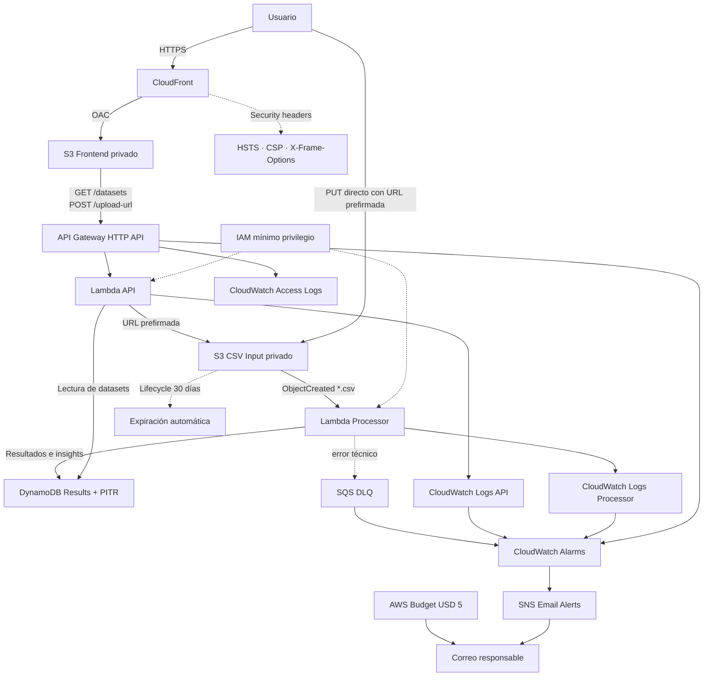

# Arquitectura del Proyecto DatosSur

## 1. Contexto de negocio

DatosSur está orientado a pequeños emprendimientos y comercios que registran sus ventas en archivos CSV o planillas. En este contexto, obtener indicadores requiere normalmente ordenar datos, construir fórmulas, preparar tablas dinámicas y generar gráficos manualmente.

El proyecto automatiza ese proceso y transforma un archivo de ventas en:

- métricas ejecutivas;
- rankings de productos y categorías;
- porcentaje de calidad de datos;
- concentración de ventas;
- insights explicativos;
- recomendaciones basadas en reglas.

La propuesta no reemplaza sistemas contables ni herramientas de inteligencia empresarial de gran escala. Su alcance es entregar una primera lectura comercial rápida, comprensible y reproducible.

## 2. Objetivos de arquitectura

La solución se diseñó para cumplir los siguientes objetivos:

1. Ejecutar el procesamiento únicamente cuando exista una carga.
2. Evitar servidores permanentes y costos fijos.
3. Mantener el frontend y los archivos de entrada privados.
4. Separar presentación, API, procesamiento y persistencia.
5. Tolerar fallos técnicos mediante reintentos y DLQ.
6. Tratar errores de formato como errores de negocio controlados.
7. Registrar métricas, logs y alarmas.
8. Permitir reconstrucción completa mediante Terraform.
9. Escalar sin administrar infraestructura de cómputo.
10. Mantener un costo compatible con un Budget de USD 5.

## 3. Decisión de usar serverless

El flujo de DatosSur es esporádico y dirigido por eventos: un archivo se procesa cuando un usuario lo carga. No existe una carga sostenida que justifique una instancia encendida permanentemente.

Se eligieron servicios serverless porque:

- Lambda ejecuta código por invocación;
- S3 almacena archivos y emite eventos;
- DynamoDB opera bajo demanda;
- API Gateway expone una API administrada;
- CloudFront distribuye el frontend sin servidor web propio;
- SQS aporta desacoplamiento ante fallos;
- CloudWatch centraliza logs y alarmas.

### Alternativas descartadas

**EC2.** Requeriría una instancia, volumen EBS, dirección IPv4, actualizaciones, respaldos y administración del sistema operativo. Además, tendría costo fijo aunque no existan cargas.

**ECS/Fargate.** Es apropiado para aplicaciones contenerizadas persistentes, pero añade complejidad innecesaria para dos funciones pequeñas y event-driven.

**RDS.** El modelo de DatosSur almacena documentos de resultado identificados por `dataset_id`; no requiere relaciones complejas ni transacciones SQL.

**VPC, NAT Gateway y ALB.** Los servicios seleccionados pueden comunicarse mediante endpoints administrados. Una VPC aumentaría costo y operación sin mejorar el caso actual.

## 4. Diagrama general



El código Mermaid se mantiene en `docs/diagramas/arquitectura.mmd`.

## 5. Flujo principal

### 5.1 Acceso al frontend

1. El usuario accede a CloudFront mediante HTTPS.
2. CloudFront obtiene `index.html`, `app.js`, `styles.css` y `config.js` desde un bucket S3 privado.
3. Origin Access Control permite que solo CloudFront lea el bucket.
4. CloudFront agrega cabeceras de seguridad y evita el uso de una versión obsoleta del frontend.

### 5.2 Solicitud de carga

1. El usuario selecciona un archivo.
2. El frontend valida extensión, tamaño y presencia de contenido.
3. `POST /upload-url` envía nombre y tamaño declarado.
4. API Gateway aplica CORS y throttling.
5. Lambda API valida la solicitud y genera una URL prefirmada.
6. La URL expira después de 900 segundos.

### 5.3 Carga directa

1. El navegador realiza un `PUT` directo a S3.
2. La carga no atraviesa Lambda ni API Gateway.
3. Esto reduce duración, transferencia intermedia y costo de cómputo.
4. El bucket acepta el origen vigente de CloudFront mediante CORS.

### 5.4 Procesamiento

1. S3 emite un evento `ObjectCreated`.
2. Lambda Processor obtiene el archivo.
3. Verifica extensión, tamaño, estructura y encabezados.
4. Interpreta campos entre comillas, comas internas y BOM.
5. Valida cada fila.
6. Calcula métricas, rankings, concentración, calidad e insights.
7. Guarda el resultado en DynamoDB.
8. El frontend espera la clave exacta del archivo y actualiza el dashboard.

## 6. Flujo de errores

### Error de validación

Ejemplos:

- CSV vacío;
- encabezados faltantes;
- archivo sin filas válidas;
- fecha incorrecta;
- cantidad inválida;
- precio incorrecto.

Comportamiento:

1. Se crea un registro con estado `ERROR`.
2. Se guarda el tipo, mensaje y detalle del error.
3. El log se registra como advertencia.
4. La excepción no se relanza.
5. No se activan reintentos ni la DLQ.

### Error técnico

Ejemplos:

- error al leer S3;
- error al escribir DynamoDB;
- fallo inesperado de ejecución.

Comportamiento:

1. Se registra el error técnico.
2. La excepción se relanza.
3. Lambda aplica su política de reintentos.
4. Si persiste, el evento puede llegar a la DLQ.
5. CloudWatch puede activar una alarma y SNS notifica.

Esta separación evita que un error esperado del archivo sea tratado como una caída de infraestructura.

## 7. Componentes

### 7.1 CloudFront y frontend

Responsabilidades:

- exponer la aplicación mediante HTTPS;
- mantener privado el bucket de origen;
- agregar cabeceras de seguridad;
- distribuir archivos estáticos;
- servir `config.js` con el endpoint vigente.

Controles aplicados:

- Origin Access Control;
- HSTS;
- Content Security Policy;
- `X-Frame-Options: DENY`;
- `X-Content-Type-Options: nosniff`;
- `Referrer-Policy`;
- política de caché para evitar frontend desactualizado.

### 7.2 API Gateway HTTP API

Rutas:

```text
GET  /health
GET  /datasets
GET  /datasets/{dataset_id}
POST /upload-url
```

Configuración:

- throttling de 10 solicitudes por segundo;
- burst de 20;
- CORS restringido;
- access logs JSON;
- integración proxy con Lambda.

Se eligió HTTP API por su menor complejidad y costo frente a REST API para este conjunto de rutas.

### 7.3 Lambda API

Responsabilidades:

- responder `/health`;
- listar hasta el límite configurado de datasets;
- obtener un dataset por ID;
- validar solicitudes de carga;
- generar URL prefirmada;
- devolver errores HTTP estructurados.

Variables principales:

```text
RESULTS_TABLE_NAME
INPUT_BUCKET_NAME
MAX_UPLOAD_SIZE_BYTES
UPLOAD_URL_EXPIRATION_SECONDS
DATASET_LIMIT
ALLOWED_ORIGIN
```

### 7.4 Bucket CSV Input

Características:

- acceso público bloqueado;
- cifrado del lado de servidor;
- versionamiento;
- CORS restringido;
- prefijo `uploads/`;
- notificación hacia Lambda;
- expiración de objetos a 30 días;
- eliminación de versiones no vigentes después de 7 días.

### 7.5 Lambda Processor

Responsabilidades:

- leer el archivo;
- validar formato y contenido;
- calcular resultados;
- guardar `COMPLETADO` o `ERROR`;
- distinguir errores de negocio y errores técnicos.

Resultados principales:

```text
totalSales
totalUnits
transactionCount
invalidRows
averageTicket
averageUnitValue
datasetQuality
topProductsDetailed
topProductsByRevenue
categoryRanking
insights
recommendationDetails
analysisVersion
```

El indicador comercial combina calidad y concentración. No representa rentabilidad.

### 7.6 DynamoDB

Tabla:

```text
datossur-dev-results
```

Clave:

```text
dataset_id
```

Datos almacenados:

- nombre y bucket;
- estado y fecha;
- métricas principales;
- resumen JSON;
- tipo y detalle del error, cuando corresponde.

Configuración:

- modo `PAY_PER_REQUEST`;
- cifrado administrado;
- Point-in-Time Recovery habilitado.

### 7.7 SQS DLQ

La DLQ recibe fallos técnicos persistentes de la Lambda procesadora.

Durante las pruebas de validación:

```text
ApproximateNumberOfMessages = 0
ApproximateNumberOfMessagesNotVisible = 0
ApproximateNumberOfMessagesDelayed = 0
```

Esto demostró que los CSV inválidos no fueron enviados erróneamente a la cola.

### 7.8 CloudWatch y SNS

Logs:

```text
/aws/lambda/datossur-dev-api
/aws/lambda/datossur-dev-processor
/aws/apigateway/datossur-dev-http-api/access
```

Alarmas:

- errores de Lambda API;
- errores de Lambda Processor;
- errores 5XX de API Gateway;
- mensajes visibles en la DLQ.

SNS envía notificaciones al correo configurado localmente mediante `owner_email`.

### 7.9 Budget

Budget mensual:

```text
datossur-dev-monthly-budget
```

Límite:

```text
USD 5
```

Alertas:

- 80 %;
- 100 % real;
- 100 % proyectado.

## 8. Escalabilidad

Los servicios seleccionados escalan de forma administrada:

- CloudFront distribuye contenido desde su red global.
- S3 soporta cargas concurrentes.
- API Gateway administra conexiones y aplica throttling.
- Lambda crea concurrencia según eventos.
- DynamoDB on-demand adapta capacidad sin aprovisionamiento manual.
- SQS retiene eventos fallidos.

Para el alcance académico no se agregaron límites de concurrencia reservada ni particionamiento complejo. Estos controles podrían incorporarse ante una carga real mayor.

## 9. Alta disponibilidad y resiliencia

Los componentes administrados operan con redundancia dentro de la región. La solución no depende de una única instancia ni de una zona de disponibilidad administrada por el equipo.

Medidas aplicadas:

- servicios regionales administrados;
- CloudFront como capa de distribución;
- reintentos de Lambda para fallos técnicos;
- DLQ;
- PITR de DynamoDB;
- versionamiento de S3;
- lifecycle;
- alarmas;
- IaC reproducible.

La arquitectura no implementa recuperación multi-región. Esa decisión se considera proporcional al bajo impacto y presupuesto del MVP.

## 10. Seguridad

### Identidad y acceso

- Roles separados para cada Lambda.
- Permisos acotados a acciones y recursos requeridos.
- Sin access keys en el código.
- Backend y variables locales ignorados por Git.

### Datos

- Buckets privados.
- Cifrado S3.
- DynamoDB cifrado.
- HTTPS.
- OAC para frontend.
- PITR para resultados.

### Capa web

- CORS restringido al dominio de CloudFront.
- CSP limitada al frontend, API y bucket vigentes.
- HSTS.
- Protección contra framing.
- Tipo de contenido protegido.
- URL prefirmada temporal.
- Validación de tamaño y extensión.
- Throttling.

### Limitación aceptada

No existe autenticación. La API es pública y está protegida por controles de abuso básicos, no por identidad de usuario. Cognito se considera una mejora futura si el producto evoluciona a un servicio multiusuario.

## 11. Infraestructura como Código

Terraform se organiza en:

```text
infra/
├── bootstrap/
├── modules/
│   ├── storage/
│   ├── processing/
│   ├── api/
│   ├── frontend/
│   ├── monitoring/
│   └── budget/
├── backend.tf
├── locals.tf
├── main.tf
├── outputs.tf
├── providers.tf
├── variables.tf
└── versions.tf
```

El bootstrap crea:

- bucket S3 de estado;
- versionamiento;
- cifrado;
- bloqueo de acceso público;
- tabla DynamoDB para lock.

El ciclo validado comprende:

```text
terraform init
terraform fmt -recursive
terraform validate
terraform plan
terraform apply
terraform plan sin cambios
terraform destroy
```

El destroy final se ejecuta únicamente después de la evaluación y de guardar evidencias.

## 12. Observabilidad

La arquitectura permite responder:

- qué ruta se llamó;
- qué estado HTTP se devolvió;
- qué archivo se procesó;
- si el error fue de negocio o técnico;
- si existen mensajes en la DLQ;
- si Lambda o API Gateway generan errores;
- si el gasto se acerca al límite mensual.

Los access logs de API Gateway usan formato JSON para facilitar filtrado.

## 13. Costos

El detalle está en `docs/costos.md`.

Resumen:

| Escenario | Costo |
|---|---:|
| MVP académico conservador | USD 0,71/mes |
| 10.000 CSV mensuales | USD 4,33/mes |
| Costo real observado | USD 0,00 |
| EC2 mínima | USD 11,88/mes |

El enfoque serverless evita instancias, EBS, IPv4 pública, balanceador y administración permanente.

## 14. Limitaciones y evolución

Limitaciones actuales:

- sin autenticación;
- sin aislamiento por usuario;
- sin paginación completa;
- recomendaciones basadas en reglas;
- límite de 5 MB;
- sin analítica histórica entre múltiples datasets;
- sin predicción de demanda;
- sin multi-región.

Evolución posible:

1. Cognito y separación por negocio.
2. Paginación y GSI en DynamoDB.
3. Comparación temporal entre datasets.
4. Exportación de reportes.
5. Reglas configurables por rubro.
6. Predicción con historial suficiente.
7. CI/CD.
8. WAF si la aplicación se publica de forma permanente.

## 15. Conclusión

La arquitectura cumple el flujo funcional completo con servicios coherentes con una carga event-driven. El uso de componentes administrados reduce operación, permite escalar y mantiene el costo bajo.

La combinación de validación, observabilidad, resiliencia, controles web, recuperación de datos y Terraform convierte el MVP en una solución demostrable y reproducible, no solo en una prueba aislada.
